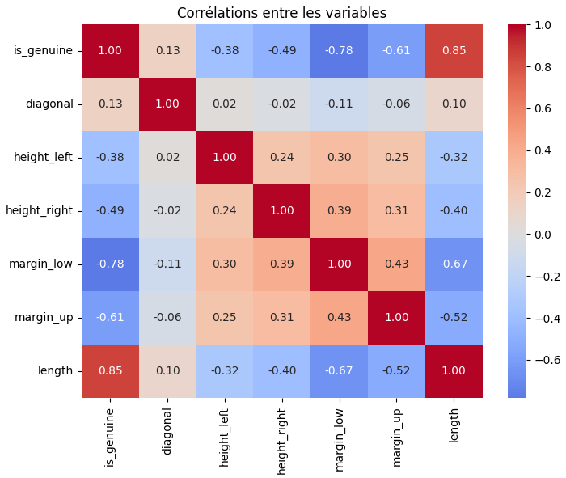
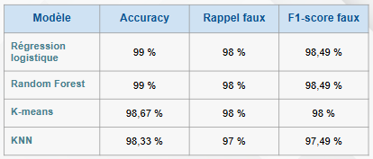
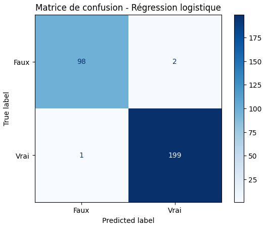
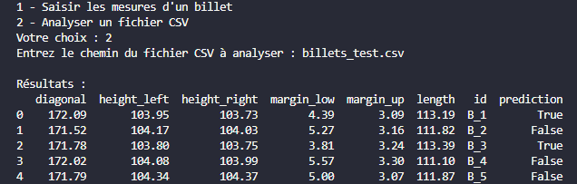

[Version française en bas / French version below]

# Counterfeit Banknote Detection

### Project Overview

This project focuses on detecting counterfeit banknotes using machine learning based on their geometric characteristics.

I developed and compared several classification approaches to identify patterns that distinguish genuine banknotes from counterfeit ones. The selected model was then integrated into a Python application capable of making predictions on new data.

The project includes:
- Exploratory data analysis
- Data cleaning and preprocessing
- Supervised and unsupervised machine learning
- Model comparison and evaluation
- Analysis of classification errors
- Prediction on new banknote data

### Tools & Skills

- Python
- Pandas
- Scikit-learn
- Matplotlib
- Seaborn
- Joblib
- Data preprocessing
- Machine learning
- Model evaluation
- Data visualization

### Exploratory Data Analysis

The exploratory analysis was used to investigate relationships between the geometric characteristics of the banknotes and identify variables relevant to counterfeit detection.

### Machine Learning

Several machine learning approaches were compared, including supervised classification models and an unsupervised clustering approach.

The models were evaluated using several metrics, with particular attention paid to the ability to correctly detect counterfeit banknotes.

### Model Evaluation

The selected model achieved 99% accuracy on the test dataset and correctly detected 98% of counterfeit banknotes.

The confusion matrix was used to analyze classification errors and ensure that overall accuracy did not hide errors involving counterfeit banknotes.

### Prediction Application

The selected model was integrated into a Python application capable of analyzing new banknote data.

The application supports:
- Prediction for an individual banknote from its geometric measurements
- Analysis of multiple banknotes from a CSV file
- Automatic preprocessing before prediction
- Preservation of banknote identifiers when available

> This repository presents a portfolio version of the project. Some implementation details, datasets, and code are intentionally not included.

---

# Détection de faux billets avec Machine Learning

### Présentation du projet

Ce projet porte sur la détection de faux billets à l'aide du machine learning, à partir de leurs caractéristiques géométriques.

J'ai développé et comparé plusieurs approches de classification afin d'identifier les caractéristiques permettant de différencier les billets authentiques des billets contrefaits. Le modèle retenu a ensuite été intégré dans une application Python capable d'effectuer des prédictions sur de nouvelles données.

Le projet comprend :
- Analyse exploratoire des données
- Nettoyage et prétraitement des données
- Apprentissage supervisé et non supervisé
- Comparaison et évaluation de plusieurs modèles
- Analyse des erreurs de classification
- Prédiction sur de nouveaux billets

### Outils & compétences

- Python
- Pandas
- Scikit-learn
- Matplotlib
- Seaborn
- Joblib
- Prétraitement des données
- Machine learning
- Évaluation de modèles
- Data visualisation

### Analyse exploratoire

L'analyse exploratoire permet d'étudier les relations entre les différentes caractéristiques géométriques des billets et d'identifier les variables pertinentes pour la détection des contrefaçons.

### Machine Learning

Plusieurs approches de machine learning ont été comparées, avec des modèles de classification supervisée ainsi qu'une approche de clustering non supervisée.

Les modèles ont été évalués à l'aide de plusieurs métriques, avec une attention particulière portée à leur capacité à détecter correctement les faux billets.

### Évaluation du modèle

Le modèle retenu obtient une accuracy de 99 % sur le jeu de test et permet de détecter correctement 98 % des faux billets.

La matrice de confusion permet d'analyser les erreurs de classification et de vérifier que les performances globales du modèle ne masquent pas des erreurs concernant les faux billets.

### Application de prédiction

Le modèle retenu a été intégré dans une application Python permettant d'analyser de nouvelles données.

L'application permet :
- D'effectuer une prédiction à partir des caractéristiques d'un billet
- D'analyser plusieurs billets à partir d'un fichier CSV
- D'appliquer automatiquement le prétraitement nécessaire avant la prédiction
- De conserver l'identifiant des billets lorsqu'il est disponible

> Ce dépôt présente une version portfolio du projet. Certains détails d'implémentation, jeux de données et éléments de code ne sont volontairement pas inclus.
